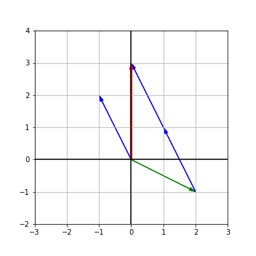

# 第一讲：方程组的几何解释

我们从求解线性方程组来开始这门课，从一个普通的例子讲起：方程组有$2$个未知数，一共有$2$个方程，分别来看方程组的“行图像”和“列图像”。

有方程组$\begin{cases}2x&-y&=0\\-x&+2y&=3\end{cases}$，写作矩阵形式有$\begin{bmatrix}2&-1\\-1&2\end{bmatrix}\begin{bmatrix}x\\y\end{bmatrix}=\begin{bmatrix}0\\3\end{bmatrix}$，通常我们把第一个矩阵称为系数矩阵$A$，将第二个矩阵称为向量$x$，将第三个矩阵称为向量$b$，于是线性方程组可以表示为$Ax=b$。

每一个`row`在二维坐标系中表示了一条线，而两条线的交线就是方程组的解：

没一个`col`在二维坐标系中表示了一个向量：
$$x\begin{bmatrix}2\\-1\end{bmatrix}+y\begin{bmatrix}-1\\2\end{bmatrix}=\begin{bmatrix}0\\3\end{bmatrix}$$
The green vector $\overrightarrow {col_1}(2,-1)$ and the blue vector $\overrightarrow {col_2}(-1,2)$. Geometrically, we want to find numbers $x$ and $y$ so that $x$ copies of vector $\overrightarrow {col_1}$ added to $y$ copies of vector $\overrightarrow  {col_2}$ equals to the vector $\vec b$. From the Fig below, we can find that $x = 1; y =2$ agreing with the above `row` picture.

By combing two columns together, we get the so-called *coefficient matrix*, $A = \left[ \begin{matrix} 2 & -1 \\-1 & 2 \end{matrix} \right]$. The linear equation becomes to 

$$
\left[ \begin{matrix} 
2 & -1 \\
-1 & 2 
\end{matrix} \right]
\left[ \begin{matrix}  x\\y \end{matrix} \right]
= 
\left[ \begin{matrix}  0\\3 \end{matrix} \right]
$$
Then we get:
$$A \vec x = \vec b$$

来看如何计算矩阵乘以向量：

1. 我们依然使用列向量线性组合的方式，一次计算一列，

$$\begin{bmatrix}2&5\\1&3\end{bmatrix}\begin{bmatrix}1\\2\end{bmatrix}=1\begin{bmatrix}2\\1\end{bmatrix}+2\begin{bmatrix}5\\3\end{bmatrix}=\begin{bmatrix}12\\7\end{bmatrix}$$

2. 使用向量内积，矩阵第一行向量点乘$x$向量

$$\begin{bmatrix}2&5\end{bmatrix}\cdot\begin{bmatrix}1&2\end{bmatrix}^T=12,\ \begin{bmatrix}1&3\end{bmatrix}\cdot\begin{bmatrix}1&2\end{bmatrix}^T=7$$

> 教授建议使用第一种方法，将$Ax$看做$A$列向量的线性组合。

If the linear combinations of the column vectors can not fill the $xy$-plane (or space, in the three dimensional case), $A$ is a *singular matrix* and its column vectors are *linearly dependent*. 
> All linear combinations of those vectors lie on a point or line (in two dimensions) or on a point, line or plane (in three dimensions). The combinations don’t fill the whole space.

总结：

1. 在二维直角坐标系中，每一个方程将确定一条线，而例子中的两个平面会相交于一点，这个点就是方程组的解；
2. 两种方法计算矩阵和向量的乘积：1. 列向量的线性组合；2. 向量内积;
3. If the linear combinations of the column vectors can not fill the $xy$-plane (or space, in the three dimensional case), $A$ is a *singular matrix* and its column vectors are *linearly dependent*. 

下一讲 [矩阵消元](chapter02.md)